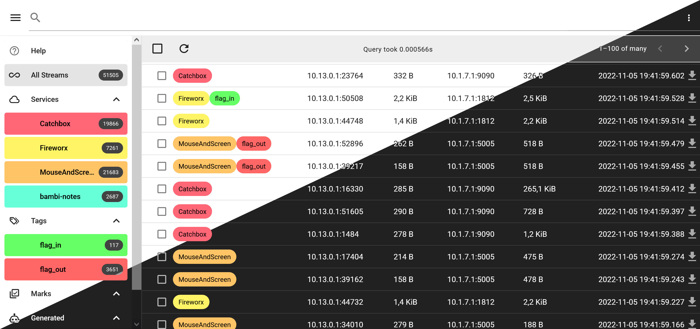
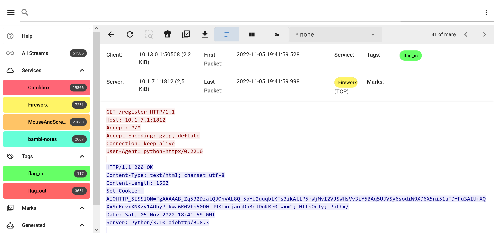
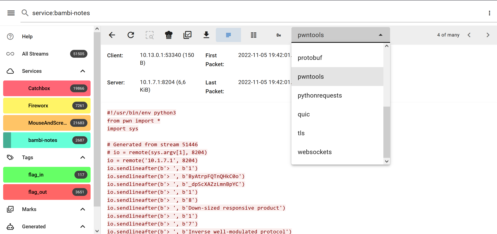
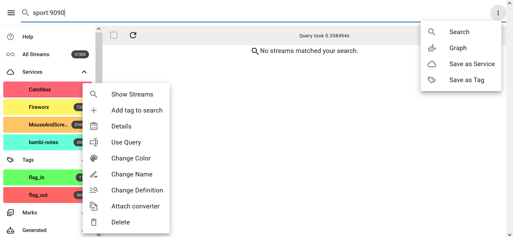
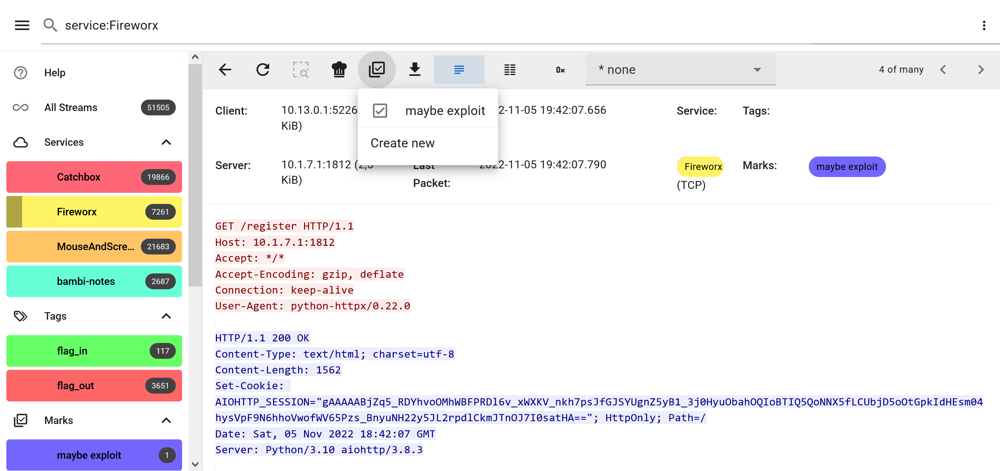
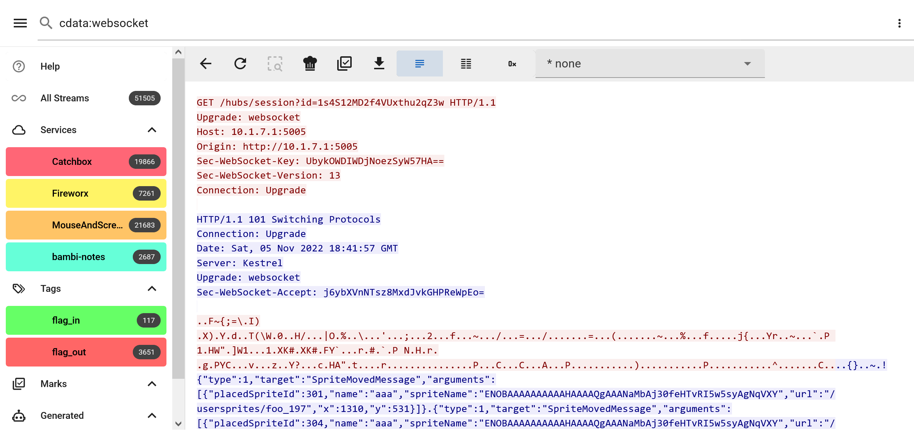

# Pkappa2

[](https://raw.githack.com/wiki/spq/pkappa2/coverage.html)

Pkappa2 is a packet stream analysis tool intended for Attack & Defense CTF competitions.
It receives pcap files via a http upload, usually send by a tcpdump-complete script, or using Pcap-over-IP.
The received pcaps are processed and using the web interface, users can run queries over the streams.
Streams matching the query are displayed, and their content can be viewed in multiple formats.





Add pcaps using a POST request to `/upload/filename.pcap`. Make sure the filename is unique.
```
curl --data-binary @some-file.pcap http://localhost:8080/upload/some-file.pcap
```

## Features
- Structured search over TCP/UDP streams
    - Match on stream data as well as metadata
- Setup wizard on first use
- Ingest traffic using PCAP-over-IP or HTTP POST requests
- Support IPv4 and IPv6
- Save queries as services or tags for quick lookup
- Scriptable stream [data converters](./converters/pkappa2lib/README.md)
    - Run converters on tag matches automatically and search their output
- Responsive UI with real time updates over Websocket
- Mark interesting streams for team members
- Easy deployment using Docker or single binary

### Searching streams
Pkappa2 uses a custom query language which allows you to find the exact streams you're interested in.
The query format supports a list of filters joined using `[AND]|OR|THEN`. Filters follow the format of `key:value` or `key:"value"`. There are different keys including the stream's data and metadata such as host and port, time, and number of bytes transferred. Checkout the Help page in the frontend for more details.

You can look for streams containing a regex using the `[cs]data` filter:
```
data:"something interesting"
```
The matches will be highlighted in the stream data.

To only search in the `c`lient or `s`erver side of the stream, you can prefix the filter key with `c` or `s` respectively:
```
cdata:flag\{[0-9a-zA-Z\_]\}
```
This matches all streams where the client sent a flag matching that regex.

You can look for temporal relations between data sent in a stream using the `THEN` operator.
```
cdata:"GET /\?q=users" then sdata:"<p class=""front"">[0-9]+<"
```
This would show all streams where first the client sends a GET request to a certain endpoint and then the server answers with some data.

After saving a query as a service or tag, you can include that service in your query to only look for streams of a certain kind.
```
service:MouseAndScreen cdata:websocket
```
This matches all streams matching the `MouseAndScreen` query and containing the word `websocket`.

### Saving queries as services or tags
You can save a query in different types of named tags. The `service` tags are used to separate traffic of the tasks in the CTF. They are usually queries involving the server port like `sport:8080`, but can take other factors like the server's IP into account too `sport:8008 shost:10.1.7.1`.

To save the current query as a service, select `Save as Service` from the menu in the top-right corner:

Other queries can be saved as general `tags` in the same way. The most common tags are `flag_in` and `flag_out` which look for the flag format in `cdata` and `sdata` respectively.

Services and `flag_in` and `flag_out` tags can be created using the `Setup wizard` when first visiting pkappa2 while no tags are saved yet too.

### Marking interesting streams
Whenever a stream stands out, and you don't want to lose it, you can mark the stream for everyone to find quickly. You can do it from the result list using the checkbox or in the stream view directly. The marks will show up in the sidebar.



### Using stream data converters
Every stream can be processed by an external script selected in the stream view. There are several converters decoding well known protocols like HTTP, HTTP/2, Websockets, DNS, gRPC, TLS, and more. You can write your own converter for a challenge and decrypt or otherwise enhance the output quickly. The details on how the converter programs communicate with pkappa2 are documented in the [converters folder](./converters/pkappa2lib/README.md).

All files in the `./converters` folder have to be executable scripts following the described JSON line protocol over stdin/stdout. You can add your own script to the folder and select it in the UI immediately for testing.

#### Attaching converters to tags / Searchable converter output
You can specify that converters should be run whenever a stream matches a tag or service by selecting the `Attach converter` option in the menu next to the tags name in the sidebar. All existing and future matches are run through the converter and the output is saved to disk. **This allows you to search through the converter output too.** Whenever a stream matching that tag is viewed, the attached converter view is pre-selected.




## Installation
Getting started with a pkappa2 instance is straight forward. You can run it natively or use a Docker container.

### Docker
```shell
$ git clone https://github.com/spq/pkappa2
$ cd pkappa2
$ cp .env.example .env
# modify settings in .env file. specify HTTP basic auth passwords etc.
$ docker compose up -d
```
Open http://localhost:8080/ to access the web interface.
The `converters` folder is mapped into the container for you to tweak.
All command line options can be specified using environment variables.

### Manually

- Requires [go](https://go.dev/dl/) 1.23+
- Install required dependencies
    - libpcap (e.g. `apt install libpcap-dev`)
- Build the frontend: `yarn && yarn build` in `/web`
    - Optionally, install stock converter python dependencies: `pip install -r converters/pkappa2lib/requirements.txt`
    - Only required to use the converter views
- Run `go run cmd/pkappa2/main.go` in `/`
- Visit http://localhost:8080/ in your web browser

You likely want to add some arguments to the `go run` command, check `-help`

### Reverse proxy
You can add a reverse proxy in front of pkappa2 to add TLS encryption or other options. Here is a nginx config which includes the `/ws` Websocket endpoint. You can bind the port to 127.0.0.1 in the docker-compose.yml to not expose the internal server when using a reverse proxy.

```
server {
    listen 80;
    listen [::]:80;
    server_name pkappa2.your.team;
    client_max_body_size 100M;

    location / {
            proxy_http_version 1.1;
            proxy_set_header Host $http_host;
            proxy_set_header Connection $http_connection;
            proxy_set_header X-Real-IP $remote_addr;
            proxy_set_header X-Forwarded-For $proxy_add_x_forwarded_for;
            proxy_set_header X-Forwarded-Proto $scheme;
            proxy_pass http://127.0.0.1:8080/;
    }
    location /ws {
            proxy_http_version 1.1;
            proxy_set_header Upgrade $http_upgrade;
            proxy_set_header Connection $http_connection;
            proxy_set_header Host $http_host;
            proxy_set_header X-Real-IP $remote_addr;
            proxy_set_header X-Forwarded-For $proxy_add_x_forwarded_for;
            proxy_set_header X-Forwarded-Proto $scheme;
            proxy_pass http://127.0.0.1:8080/ws;
    }
}
```

### Collecting traffic on the vulnbox
The standard way to get pcaps into pkappa2 is using a `-z` completion script of `tcpdump`. The following scripts can be adjusted for your needs. It's important to exclude any traffic that's generated while uploading the pcaps, you'll get exponential pcap file size growth otherwise. Limiting the capture to the game VPN interface and uploading pcaps to an external IP works for separation. Edit the tcpdump filter according to your setup.

pkappa2 supports two different HTTP basic auth passwords. One for accessing the user interface and another one for uploading pcaps to the `/upload/[filename]` endpoint only. Make sure to use the correct pcap password here.

Add these scripts to your vulnbox and run `tcpdump.sh` as root. Make sure the `tcpdump_complete.sh` script is executable and the `pcaps` folder is only readable by root. 😉

**tcpdump.sh**:
```shell
#!/bin/bash
set -e
cd "$(dirname "$0")"

INTERVAL=30
PCAP_DIR="`pwd`/pcaps"
IFACE="game"

tcpdump -n -i $IFACE "(tcp or udp) and not (port 22)" -Z root -G $INTERVAL -w "${PCAP_DIR}/$IFACE_%Y%m%d_%H%M%S.pcap" -z "`pwd`/tcpdump_complete.sh"
```

**tcpdump_complete.sh**:
```shell
#!/bin/bash
PKAPPA2_IP=127.0.0.1
PKAPPA2_PORT=80
PKAPPA2_USER="admin"
PKAPPA2_PASSWD="your_pcap_password"
echo "FINISHED $1"

curl --data-binary "@$1" http://"${PKAPPA2_USER}":${PKAPPA2_PASSWD}@${PKAPPA2_IP}:${PKAPPA2_PORT}/upload/`basename $1`

rm "$1"
```

#### PCAP-over-IP
Alternatively, Pkappa2 supports connecting to PCAP-over-IP servers and grabbing packets in real-time. One such server is [foxit-it/pcap-broker](https://github.com/fox-it/pcap-broker) which can be launched next to your pkappa2 instance.

A convenient way to set this up is [using a ssh tunnel](https://github.com/fox-it/pcap-broker?tab=readme-ov-file#acquiring-pcap-data-over-ssh) from the pkappa2 host to the vulnbox, running `tcpdump` on the vulnbox and tunneling the output to pkappa2. Only tcpdump and ssh must be available on the vulnbox for this to work. You'll have to add a private key to the root user's `~/.ssh/authorized_keys` on the vulnbox file to allow the pcap-broker user to connect.

Add the `localhost:4200` endpoint in pkappa2 on the `Manage PCAP-over-IP` page accessible through the `More` option in the sidebar. Adjust the port accordingly if you add this to pkappa2's docker-compose.yml to use the internal docker network between the containers.

## UI Development

- Build the frontend once (`yarn build`) to be able to run pkappa2
- Run `yarn dev` in `/web`
- Run `go run cmd/pkappa2/main.go -address :8081` in `/`
- Visit http://localhost:8080/ in your web browser
- Enjoy frontend development using hot-reloading changes
- Use `yarn lint && yarn type-check && yarn format` before commiting your changes

You can import multiple .pcap files in the current folder using:
`for f in *.pcap; do curl --data-binary "@$f" "http://localhost:8081/upload/$f"; done`

### Generating type guards

We use type guards to verify the JSON communication with the backend. In order to generate all the typeguards, go to `web/` and call
```
npx ts-auto-guard
```

When getting api-responses about types mismatching, you can debug the typeguards via
```
npx ts-auto-guard --debug
```
